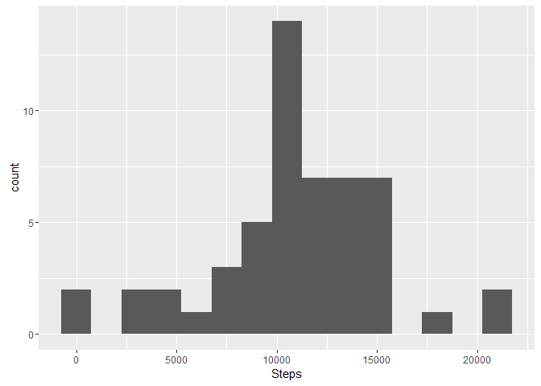
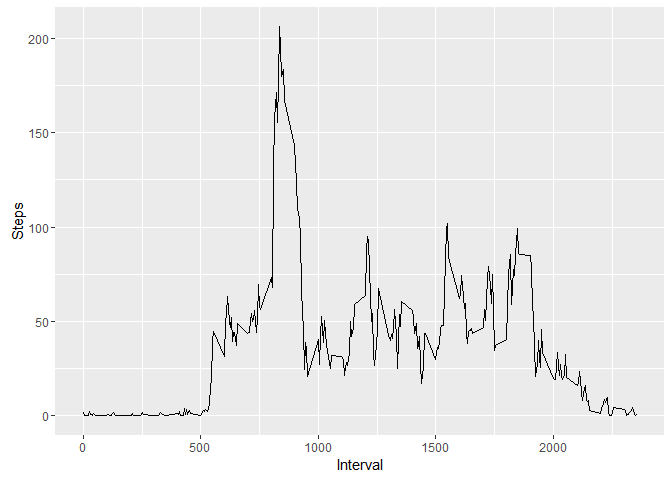
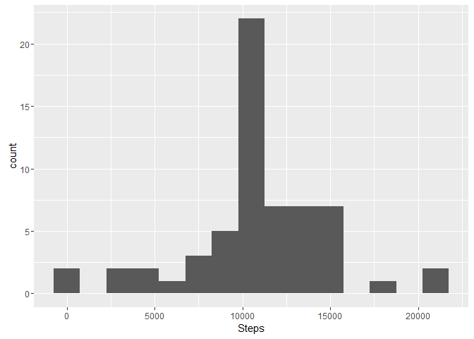
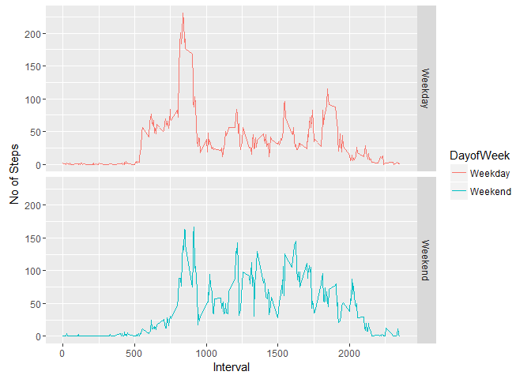

# Reproducible Research: Peer Assessment 1


## Loading and preprocessing the data  

### Reading in the dataset and/or processing the data  

```r
library("data.table")
data <- read.csv("activity.csv")
dt <- data.table(data)
names(dt) <- c("Steps","Date","Interval")
head(dt)
```

```
##    Steps       Date Interval
## 1:    NA 2012-10-01        0
## 2:    NA 2012-10-01        5
## 3:    NA 2012-10-01       10
## 4:    NA 2012-10-01       15
## 5:    NA 2012-10-01       20
## 6:    NA 2012-10-01       25
```

## What is mean total number of steps taken per day?
Filter out any "NA" values in the data set and aggregate the total sum of steps per day.  

```r
dt2 <- na.omit(dt)
dttotal <- aggregate(Steps~Date, data = dt2,sum)
head(dttotal)
```

```
##         Date Steps
## 1 2012-10-02   126
## 2 2012-10-03 11352
## 3 2012-10-04 12116
## 4 2012-10-05 13294
## 5 2012-10-06 15420
## 6 2012-10-07 11015
```

### Histogram of the total number of steps taken each day
Below histogram shows the count of days for which a certain amount of steps was done.


```r
library("ggplot2")
ggplot(dttotal, aes(x=Steps)) + geom_histogram(binwidth = 1500)
```

<!-- -->

### Mean and median number of steps taken each day

Below is the mean amount of steps per day

```r
mean(dttotal$Steps)
```

```
## [1] 10766.19
```

Below shows the meadian of steps per day


```r
median(dttotal$Steps)
```

```
## [1] 10765
```

## What is the average daily activity pattern?


### Calculating the average steps per interval across all days

```r
dtmeanInterval <- aggregate(Steps~Interval, data = dt2,mean)
head(dtmeanInterval)
```

```
##   Interval     Steps
## 1        0 1.7169811
## 2        5 0.3396226
## 3       10 0.1320755
## 4       15 0.1509434
## 5       20 0.0754717
## 6       25 2.0943396
```

### Time series plot of the average number of steps taken per interval and day


```r
ggplot(dtmeanInterval, aes(Interval,Steps)) + geom_line() 
```

<!-- -->

### The 5-minute interval that, on average, contains the maximum number of steps


```r
dtmeanInterval[which.max(dtmeanInterval$Steps),]
```

```
##     Interval    Steps
## 104      835 206.1698
```

## Imputing missing values

### Code to describe and show a strategy for imputing missing data
#### Total number of rows with NAs


```r
sum(is.na(dt$Steps))
```

```
## [1] 2304
```

#### Strategy for imputing data
In order to avoid biases by removing data with "NA" values in theis steps, the proposal is to augment "NA" values with the daily average of the corresponding Interval.  The averages per Interval where already calculated and can be linked/mapped to the missing data.


```r
dtImputedTotal <- dt
names(dtmeanInterval) <- c("Interval", "MeanSteps")
dtImputedTotal <- merge( dtImputedTotal,dtmeanInterval,by="Interval")
dtImputedTotal$Steps[is.na(dtImputedTotal$Steps)] <- dtImputedTotal$MeanSteps[is.na(dtImputedTotal$Steps)]
dtImputedTotal[,MeanSteps:=NULL]
```
 
Aggregate imputed data by Date.  

```r
dtImputeaggregate <- aggregate(Steps~Date, data = dtImputedTotal,sum)
head(dtImputeaggregate)
```

```
##         Date    Steps
## 1 2012-10-01 10766.19
## 2 2012-10-02   126.00
## 3 2012-10-03 11352.00
## 4 2012-10-04 12116.00
## 5 2012-10-05 13294.00
## 6 2012-10-06 15420.00
```

### Histogram of the total number of steps taken each day after missing values are imputed


```r
ggplot(dtImputeaggregate, aes(x=Steps)) + geom_histogram(binwidth = 1500)
```

<!-- -->

### Mean and median number of steps taken each day after Imputation

Below is the mean amount of steps per day

```r
mean(dtImputeaggregate$Steps)
```

```
## [1] 10766.19
```

Below shows the meadian of steps per day


```r
median(dtImputeaggregate$Steps)
```

```
## [1] 10766.19
```

There are no significant changes in the mean or median of total Steps per day.  However there is an  increase of days with approx. 10k Steps a day. 

## Are there differences in activity patterns between weekdays and weekends?

Prepare the plotting by labeling a row with "Weekdays" and "Weekend". For that reason function weekday will help to conduct this segmentation.


```r
Sys.setlocale("LC_TIME", "C")
```

```
## [1] "C"
```

```r
weekday <- function(Date) {
    day <- weekdays(as.Date(Date, '%Y-%m-%d'))
    if  (!(day == 'Saturday' | day == 'Sunday')) {
        x <- 'Weekday'
    } else {
        x <- 'Weekend'
    }
    x
}
```

Aggregate the average steps by Interval and Day iof the week. 


```r
dtImputedTotal$DayofWeek <- as.factor(sapply(dtImputedTotal$Date, weekday))
dtImputedAverage <- aggregate(Steps~Interval + DayofWeek, data=dtImputedTotal, mean)
```
    
Panel plot comparing the average number of steps taken per 5-minute interval across weekdays and weekends


```r
ggplot(dtImputedAverage, aes(Interval, Steps)) +
    geom_line(stat = "identity", aes(colour = DayofWeek)) +
    theme_gray() +
    facet_grid(DayofWeek ~ ., scales="fixed") +
    labs(x="Interval", y=expression("No of Steps")) 
```

<!-- -->

As a result, on weekends there is more activity during the whole day measured in steps as it is on Weekdays.  On Weekdays there is significantly more activity in the morning, probably to be prepare for work duing the day.
